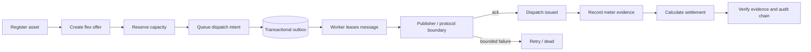
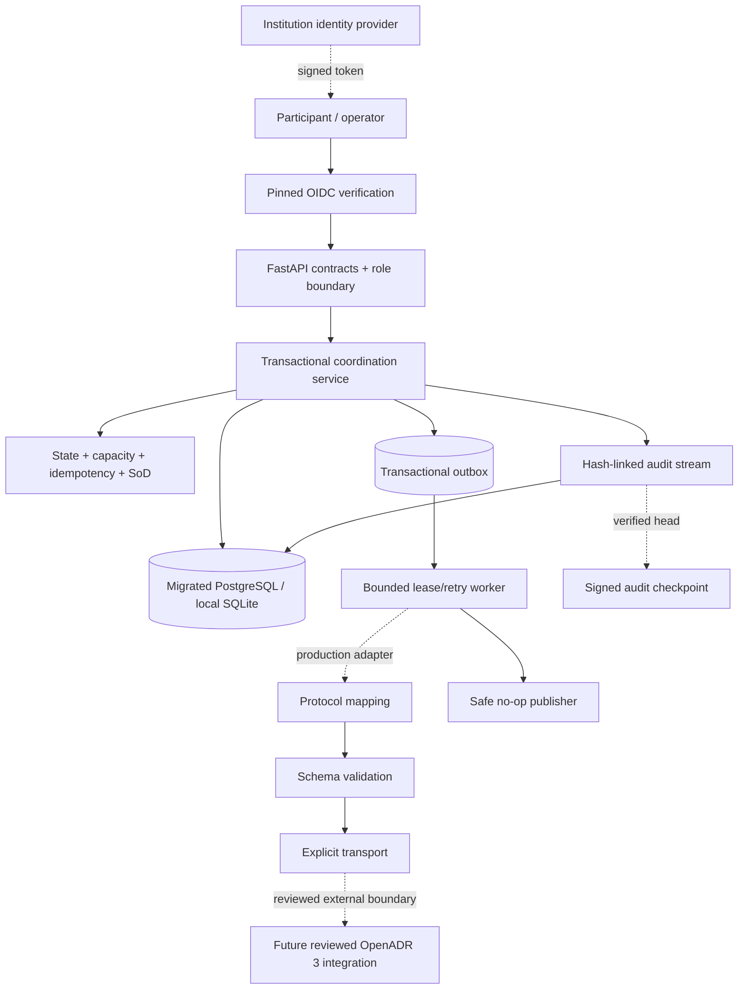

# Energy Flex Trust Platform

[](https://github.com/bilgekayali/energy-flex-trust-platform/actions/workflows/ci.yml)
[](LICENSE)
[](pyproject.toml)

A secure, auditable reference platform for coordinating distributed energy
flexibility—from asset registration and capacity reservation to durable dispatch
publication, meter evidence, and settlement proof.

The project demonstrates how operational decisions can remain traceable and
fail-closed when several organizations exchange data and trigger financially
material actions. It uses synthetic/reference data and the default outbound
publisher never contacts a live energy asset, market, meter, or external service.

> **Status:** v0.3 reliable-integration reference implementation. Not a production
> deployment, OpenADR certification, market approval, or physical-device safety
> claim.

## Why this project exists

Energy-flexibility workflows cross organizational and technical trust boundaries.
Duplicate requests, conflicting roles, altered readings, incomplete provenance,
partial database commits, publisher failures and ambiguous retries can turn an
otherwise valid dispatch into an operational or settlement dispute.

Energy Flex Trust makes the critical controls executable:

- idempotent reservation, dispatch and settlement commands;
- explicit state transitions, capacity checks and settlement separation of duties;
- fail-closed OIDC identity verification outside development/test;
- deduplicated meter evidence with deterministic fingerprints;
- append-only hash-linked audit events and signed audit checkpoints;
- reproducible settlement evidence packages;
- versioned managed database migrations;
- transactional dispatch outbox committed with domain/audit state;
- at-least-once delivery with durable downstream idempotency keys;
- bounded retry, lease expiry recovery and terminal dead-message handling;
- low-cardinality outbound delivery health signals;
- an OpenADR 3 mapping/validation/transport boundary that does not weaken the core
  transaction model or make a conformance claim.

## Workflow



A dispatch request is not considered externally issued merely because the API
transaction succeeded. The API first returns a `queued` dispatch. Settlement stays
blocked until the worker records successful publication and moves the dispatch to
`issued`.

## Visual operations dashboard

The credential-free dashboard turns the trust model into an inspectable operations
view. It includes healthy coordination, capacity stress, meter-evidence gap, and
audit-tampering scenarios. Every value is synthetic and the dashboard is read-only:
it never contacts the API, database, a market, meter, or physical asset.

```bash
python -m pip install -e ".[dashboard]"
python app.py
```

Open `http://127.0.0.1:7860`. See [Dashboard](docs/DASHBOARD.md) for the scenario
and safety boundaries.

## Quick start

### Local API

```bash
python -m venv .venv
source .venv/bin/activate
python -m pip install -e ".[dev]"
uvicorn energy_flex_trust.api:app --reload
```

Open `http://127.0.0.1:8000/docs` for the generated OpenAPI interface. SQLite is
the safe local default.

### PostgreSQL with Docker

```bash
docker compose up --build
```

This starts PostgreSQL 16 and the API at `http://127.0.0.1:8000`.

### Managed schema

Development and tests may create their local schema automatically. A
non-development deployment must apply the versioned schema first:

```bash
export DATABASE_URL='postgresql+psycopg://...'
alembic upgrade head
```

The application verifies the exact expected migration revision at startup. v0.3
expects `0002_reliable_outbox`.

## Identity boundary

Local development/test requests can use `X-Actor-ID` and `X-Actor-Role` to exercise
policy. These headers are **not authentication**. Any other environment fails
closed unless `AUTH_MODE=oidc` is configured with an exact issuer, audience and
institution-controlled JWKS document.

The OIDC verifier never performs discovery or key retrieval over the network. It
accepts pinned RS256/ES256 keys, validates time/issuer/audience claims and resolves
exactly one supported Energy Flex role.

Register an asset locally:

```bash
curl -X POST http://127.0.0.1:8000/v1/assets \
  -H 'Content-Type: application/json' \
  -H 'X-Actor-ID: owner-001' \
  -H 'X-Actor-Role: asset_owner' \
  -d '{
    "external_id": "BATTERY-GB-001",
    "owner_id": "owner-001",
    "asset_type": "battery",
    "capacity_kw": "100",
    "location_code": "GB-LON"
  }'
```

Reservation, dispatch and settlement commands require an `Idempotency-Key`.
Repeating the same command with the same key returns the same resource; reusing the
key for a changed command returns `409 Conflict`.

## Reliable dispatch publication

`POST /v1/reservations/{id}/dispatches` records a durable intent rather than making
an external call inside the request transaction. The resulting dispatch is
`queued`, its reservation is `dispatch_pending`, and the same database transaction
stores the outbox record and audit event.

Process one safe local/reference batch:

```bash
python -m energy_flex_trust.worker --limit 10
```

The bundled worker uses the no-op publisher. A production deployment must provide
a separately reviewed transport and process supervision.

Delivery is **at least once**. If a worker publishes successfully and crashes
before local finalization, the lease can expire and the message may be replayed.
The durable command idempotency key is therefore passed to the publisher contract;
a real destination must support an equivalent deduplication mechanism.

Retries use bounded exponential backoff. Exhausting the attempt budget moves the
outbox item to `dead`, rejects the dispatch, cancels the reservation, records an
audit event, and keeps settlement blocked.

See [Reliable integration](docs/RELIABLE_INTEGRATION.md) for lease, replay,
recovery and residual-risk details.

## API surface

| Method | Endpoint | Required role | Purpose |
|---|---|---|---|
| `GET` | `/health` | Public | Runtime health and version |
| `POST` | `/v1/assets` | `asset_owner` | Register a synthetic/reference flexible asset |
| `POST` | `/v1/offers` | `asset_owner` | Offer capacity within the registered limit |
| `POST` | `/v1/offers/{id}/reservations` | `market_operator` | Reserve open capacity idempotently |
| `POST` | `/v1/reservations/{id}/dispatches` | `market_operator` | Queue a dispatch intent transactionally |
| `POST` | `/v1/meter-readings` | `asset_owner`, `system` | Record and deduplicate interval evidence |
| `POST` | `/v1/reservations/{id}/settlements` | `settlement_analyst` | Settle only an acknowledged dispatch |
| `GET` | `/v1/settlements/{id}/evidence` | Auditor/operator/analyst | Retrieve and verify the evidence manifest |
| `GET` | `/v1/audit/verify` | `auditor` | Recalculate the full audit hash chain |
| `GET` | `/v1/operations/outbox` | Auditor/operator | Read aggregate outbound delivery health |

## Architecture



See [Architecture](docs/ARCHITECTURE.md), [API workflow](docs/API_WORKFLOW.md),
[v0.2 trust boundaries](docs/TRUST_BOUNDARIES.md),
[v0.3 reliable integration](docs/RELIABLE_INTEGRATION.md), and
[Threat model](docs/THREAT_MODEL.md).

## Trust guarantees in v0.3

- A reservation cannot exceed its offer.
- A dispatch cannot exceed its reservation or escape the offer window.
- Replayed command keys cannot silently change their payload.
- A dispatch API commit does not falsely imply successful external publication.
- Dispatch state remains `queued` and settlement remains blocked until an outbound
  acknowledgement is durably finalized.
- Transient publication failures are retried within an explicit bounded budget.
- Expired worker leases are recoverable.
- Terminal publication failure becomes auditable `dead` / `rejected` /
  `cancelled` state rather than silent success.
- Publisher contracts receive a durable downstream idempotency key.
- Settlement requires qualifying meter evidence and a separate settlement actor.
- Evidence manifests are content-hashed and point to an audit-chain head.
- Audit mutation, reordering and non-tail deletion are detectable by full-chain
  verification.
- Non-development runtimes cannot use caller-asserted actor headers.
- Managed deployments require the expected versioned database revision.
- A valid audit head can be bound to an Ed25519-signed checkpoint for independent
  retention or anchoring.

The outbox does not provide exactly-once delivery. The hash chain is tamper-evident,
not tamper-proof. Signed checkpoints detect later truncation only when retained
outside the compromised administrative boundary.

## OpenADR 3 boundary

OpenADR 3 is an interoperability target, not a current compliance claim.
`OpenAdr3ContractPublisher` separates domain mapping, schema validation and
transport. The repository deliberately does not copy or approximate normative
schema assets. A real integration must supply reviewed, version-pinned normative
materials and must pass separate interoperability/certification processes where
required.

The included recording transport and synthetic contract mapper are test fixtures.
They do not establish OpenADR certification, market participation approval,
settlement acceptance, grid-code conformity, or safe control of physical assets.

## Test

```bash
ruff check .
pytest
```

The suite covers the core workflow, replay conflicts, separation of duties,
suspended assets, meter deduplication, evidence verification, audit tampering,
OIDC verification, signed-checkpoint tamper detection, migrations, transactional
outbox state transitions, settlement-before-publish blocking, bounded retry,
terminal delivery failure, expired-lease recovery, operations authorization, and
OpenADR schema-before-transport behavior.

CI runs on Python 3.11, 3.12 and 3.13 and also compiles source/tests/migrations and
statically enforces the no-network OIDC verifier boundary.

## Roadmap to v1.0

The project uses release gates rather than a cosmetic version bump:

- **v0.2 — complete:** authenticated identity, signed audit checkpoints, managed
  migrations;
- **v0.3 — current gate:** reliable outbound integration, replay controls,
  observability, protocol contract boundary and failure injection;
- **v0.9 — next:** PostgreSQL recovery hardening, least-privilege deployment,
  runbooks, SBOM/provenance/container/security gates and residual-risk review;
- **v1.0:** production-reference compatibility policy, upgrade/rollback contract
  and independently reviewable release evidence.

See [Roadmap to v1.0](docs/ROADMAP.md).

## Non-claims

The repository does not claim OpenADR certification, market participation approval,
DORA/NIS2/ISO compliance, grid-code conformity, settlement acceptance, device
security, legal non-repudiation, exactly-once external effects, or safe control of
physical energy assets.

## License

Apache License 2.0. See [LICENSE](LICENSE).
