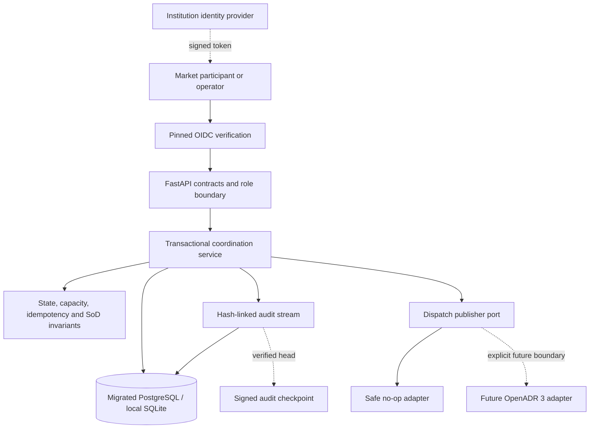

# Energy Flex Trust Platform

[](https://github.com/bilgekayali/energy-flex-trust-platform/actions/workflows/ci.yml)
[](LICENSE)
[](pyproject.toml)

A secure, auditable reference platform for coordinating distributed energy
flexibility—from asset registration and capacity reservation to dispatch, meter
evidence, and settlement proof.

The project demonstrates how operational decisions can remain traceable and safe
when several organizations exchange data and trigger financially material actions.
It uses only synthetic data and its default dispatch adapter never contacts a live
energy asset.

> **Status:** v0.2 reference implementation. Not production-ready, OpenADR
> certified, or connected to an energy market or physical device.

## Why this project exists

Energy-flexibility workflows cross organizational and technical trust boundaries.
Duplicate requests, conflicting roles, altered readings, and incomplete provenance
can turn an otherwise valid dispatch into an operational or settlement dispute.

Energy Flex Trust makes the critical controls executable:

- idempotent reservation, dispatch, and settlement commands;
- explicit state transitions and capacity checks;
- role policy and settlement separation of duties;
- fail-closed OIDC identity verification outside development/test;
- deduplicated meter readings with deterministic fingerprints;
- append-only, hash-linked audit events and signed audit checkpoints;
- reproducible settlement evidence packages;
- versioned database migrations for managed deployments;
- a safe outbound adapter boundary for future OpenADR 3 integration.

## Workflow


The main happy path is intentionally small enough to understand and strict enough
to expose the trust decisions that are often hidden in integration code.

## Visual operations dashboard

The credential-free dashboard turns the trust model into an inspectable operations
view. It includes healthy coordination, capacity stress, meter-evidence gap, and
audit-tampering scenarios. Every value is synthetic and the dashboard is read-only:
it never contacts the API, database, a market, meter, or physical asset.

```bash
python -m pip install -e ".[dashboard]"
python app.py
```

Open `http://127.0.0.1:7860`. See the [dashboard guide](docs/DASHBOARD.md) for
the scenario definitions and safety boundary.

## Quick start

### Local Python

```bash
python -m venv .venv
source .venv/bin/activate
python -m pip install -e ".[dev]"
uvicorn energy_flex_trust.api:app --reload
```

Open `http://127.0.0.1:8000/docs` for the generated OpenAPI interface.

SQLite is the safe local default. No infrastructure is required.

### PostgreSQL with Docker

```bash
docker compose up --build
```

This starts PostgreSQL 16 and the API at `http://127.0.0.1:8000`.

### Managed schema

Development and tests may create their local schema automatically. A
non-development deployment must apply the versioned schema first:

```bash
export DATABASE_URL='postgresql+psycopg://...'
alembic upgrade head
```

The application then verifies the exact expected migration revision at startup.

## Identity boundary

Local development/test requests can use `X-Actor-ID` and `X-Actor-Role` to exercise
policy. These headers are **not authentication**. Any other environment fails
closed unless `AUTH_MODE=oidc` is configured with an exact issuer, audience and
institution-controlled JWKS document.

The OIDC verifier never performs discovery or key retrieval over the network. It
accepts only pinned RS256/ES256 keys, validates standard time/issuer/audience
claims, and resolves exactly one Energy Flex role.

Register an asset locally:

```bash
curl -X POST http://127.0.0.1:8000/v1/assets \
  -H 'Content-Type: application/json' \
  -H 'X-Actor-ID: owner-001' \
  -H 'X-Actor-Role: asset_owner' \
  -d '{
    "external_id": "BATTERY-GB-001",
    "owner_id": "owner-001",
    "asset_type": "battery",
    "capacity_kw": "100",
    "location_code": "GB-LON"
  }'
```

Reservation, dispatch, and settlement endpoints also require an
`Idempotency-Key`. Repeating the same request with the same key returns the same
resource; reusing the key for a changed payload returns `409 Conflict`.

## API surface

| Method | Endpoint | Required role | Purpose |
|---|---|---|---|
| `GET` | `/health` | Public | Runtime health and version |
| `POST` | `/v1/assets` | `asset_owner` | Register a synthetic flexible asset |
| `POST` | `/v1/offers` | `asset_owner` | Offer capacity within the registered limit |
| `POST` | `/v1/offers/{id}/reservations` | `market_operator` | Reserve open capacity idempotently |
| `POST` | `/v1/reservations/{id}/dispatches` | `market_operator` | Record a safe dispatch intent idempotently |
| `POST` | `/v1/meter-readings` | `asset_owner`, `system` | Record and deduplicate interval evidence |
| `POST` | `/v1/reservations/{id}/settlements` | `settlement_analyst` | Calculate settlement with role separation |
| `GET` | `/v1/settlements/{id}/evidence` | Auditor/operator/analyst | Retrieve and verify the evidence manifest |
| `GET` | `/v1/audit/verify` | `auditor` | Recalculate the full audit hash chain |

## Architecture



See [Architecture](docs/ARCHITECTURE.md),
[API workflow](docs/API_WORKFLOW.md),
[v0.2 trust boundaries](docs/TRUST_BOUNDARIES.md), and
[Threat model](docs/THREAT_MODEL.md) for design details and limitations.

## Trust guarantees in v0.2

- A reservation cannot exceed its offer.
- A dispatch cannot exceed its reservation or escape the offer window.
- A reservation and an offer cannot be dispatched twice.
- Replayed command keys cannot silently change their payload.
- Settlement requires meter evidence fully inside the dispatch window.
- The settlement actor must differ from the reservation and dispatch actor.
- Evidence manifests are content-hashed and point to an audit-chain head.
- Audit mutation, reordering, and non-tail deletion are detectable by full-chain
  verification.
- Non-development runtimes cannot use caller-asserted actor headers.
- OIDC tokens are verified against locally pinned trust material without discovery.
- Managed deployments require the expected versioned database revision.
- A valid audit head can be bound to an Ed25519-signed checkpoint for independent
  retention or anchoring.

The hash chain is tamper-evident, not tamper-proof. A signed checkpoint only helps
detect later tail truncation if the checkpoint or its digest is retained outside
the compromised persistence boundary. Production checkpoint private keys should be
held behind an institution-owned KMS/HSM implementation of the signer protocol.

## Test

```bash
ruff check .
pytest
```

Tests cover the complete workflow, replay behavior, changed-payload conflicts,
separation of duties, suspended assets, meter deduplication, evidence verification,
deliberate audit tampering, OIDC verification, checkpoint tamper detection, and
migration upgrade/downgrade behavior.

## Roadmap to v1.0

The project uses release gates rather than jumping directly from v0.x to a
production claim:

- **v0.2:** authenticated identity, signed audit checkpoints and managed migrations;
- **v0.3:** transactional outbox, bounded outbound retries, OpenADR 3 contract
  adapter/tests, observability and deterministic failure injection;
- **v0.9:** migration/recovery hardening, least-privilege deployment, SBOM,
  provenance, container/security gates and threat-model refresh;
- **v1.0:** production-reference compatibility, upgrade/rollback contract and
  independently reviewable release evidence.

See the full [v1.0 release-gated roadmap](docs/ROADMAP.md).

## Standards boundary

OpenADR 3 is a future interoperability target, not a current compliance claim. The
`DispatchPublisher` port isolates domain behavior from external protocols so an
official-schema adapter and certification tests can be added without weakening the
core transaction guarantees.

The repository does not claim market participation approval, DORA/NIS2/ISO
compliance, grid-code conformity, settlement acceptance, device security, or safe
control of physical assets.

## License

Apache License 2.0. See [LICENSE](LICENSE).
