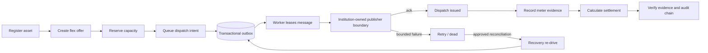
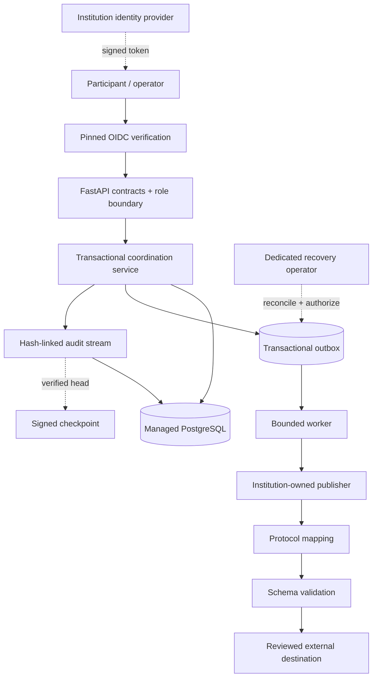

# Energy Flex Trust Platform

[](https://github.com/bilgekayali/energy-flex-trust-platform/actions/workflows/ci.yml)
[](https://github.com/bilgekayali/energy-flex-trust-platform/actions/workflows/postgres-recovery.yml)
[](https://github.com/bilgekayali/energy-flex-trust-platform/actions/workflows/security.yml)
[](LICENSE)
[](pyproject.toml)

A secure, auditable reference platform for coordinating distributed energy
flexibility—from asset registration and capacity reservation to durable dispatch
publication, meter evidence and settlement proof.

The project demonstrates how operational decisions can remain traceable and
fail-closed when several organizations exchange data and trigger financially
material actions. It uses synthetic/reference data and does not ship a credentialed
live market, meter or physical-device transport.

> **Status:** v0.9 release-candidate hardening on the path to v1.0. Package metadata
> is staged at `0.9.0`, but no release tag or production-approval claim is implied
> until the exact release gates are green and reviewed.

## Why this project exists

Energy-flexibility workflows cross organizational, protocol, identity, persistence
and operational trust boundaries. Duplicate requests, conflicting roles, altered
readings, publisher failures, partial commits, ambiguous retries and recovery errors
can turn a valid flexibility instruction into an operational or settlement dispute.

Energy Flex Trust makes the critical controls executable:

- idempotent reservation, dispatch and settlement commands;
- explicit state transitions, capacity checks and settlement separation of duties;
- fail-closed OIDC identity verification outside development/test;
- deduplicated meter evidence with deterministic fingerprints;
- hash-linked audit events and signed audit checkpoints;
- reproducible settlement evidence packages;
- exact managed Alembic schema revision checks;
- transactional dispatch outbox committed with domain/idempotency/audit state;
- at-least-once delivery with durable downstream idempotency keys;
- bounded retry, lease-expiry recovery and terminal dead-message handling;
- controlled terminal re-drive under a dedicated recovery authority;
- versioned dispatch payloads with v0.3 queue-drain compatibility;
- low-cardinality outbound delivery health signals;
- protocol mapping → schema validation → transport separation for future reviewed
  OpenADR 3 integration;
- PostgreSQL recovery and least-privilege release gates;
- SBOM, artifact digest, vulnerability analysis and build-attestation evidence.

## Workflow



A dispatch request is not considered externally issued merely because the API
transaction succeeded. The API returns a `queued` dispatch and the reservation
becomes `dispatch_pending`. Settlement remains blocked until outbound publication is
acknowledged and durably finalized.

## Quick start

### Local API

```bash
python -m venv .venv
source .venv/bin/activate
python -m pip install -e ".[dev]"
uvicorn energy_flex_trust.api:app --reload
```

Open `http://127.0.0.1:8000/docs`. SQLite is the safe local development/test
default.

### Local reference stack

```bash
docker compose up --build
```

The development compose path starts PostgreSQL and the API for local testing.

### Managed schema

A non-development deployment must apply migrations before application startup:

```bash
export DATABASE_URL='postgresql+psycopg://...'
alembic upgrade head
```

The application verifies the exact expected migration revision at startup and fails
closed on an unmigrated or mismatched managed database.

## Identity boundary

Development/test requests may use `X-Actor-ID` and `X-Actor-Role` to exercise policy.
These headers are **not authentication**. Production-like environments require
`AUTH_MODE=oidc` with exact issuer, audience and institution-controlled pinned JWKS.

The verifier performs no discovery or remote JWKS retrieval. It accepts only the
configured RS256/ES256 trust material, validates standard time/issuer/audience
claims and resolves exactly one supported Energy Flex application role.

OIDC application authorization and PostgreSQL process identities are separate
controls. v0.9 defines distinct migrator, API, worker, recovery and auditor database
roles; see [Least privilege](docs/LEAST_PRIVILEGE.md).

## Reliable dispatch publication

`POST /v1/reservations/{id}/dispatches` records a durable intent instead of calling
an external target inside the request transaction. The same transaction stores the
dispatch, reservation state, outbox message, idempotency evidence and audit event.

Delivery is **at least once**, not exactly once. A publisher can succeed immediately
before a worker crash, after which lease expiry may cause a replay. The original
durable idempotency key therefore crosses the publisher boundary and must map to an
authoritative downstream deduplication mechanism in a real integration.

Retries are bounded. Exhaustion moves the message to `dead`, rejects the dispatch,
cancels the reservation and emits audit evidence while settlement remains blocked.

### Development/test worker

```bash
python -m energy_flex_trust.worker --limit 10
```

The built-in no-op publisher is deliberately available only in `development` and
`test`. In a production-like environment, the worker fails closed unless an
institution-owned `DispatchPublisher` is explicitly injected.

### Controlled re-drive

Terminal `dead/rejected/cancelled` state can be re-armed only through the dedicated
recovery authority. Re-drive preserves the **original idempotency key**, records the
operator reason and previous-failure digest in the audit chain, and does not publish
anything itself.

See [Outbox re-drive](docs/runbooks/OUTBOX_REDRIVE.md). Recovery is intentionally
not exposed as a public `/v1` HTTP endpoint.

## API surface

| Method | Endpoint | Required role | Purpose |
|---|---|---|---|
| `GET` | `/health` | Public | Runtime health and version |
| `POST` | `/v1/assets` | `asset_owner` | Register a reference flexible asset |
| `POST` | `/v1/offers` | `asset_owner` | Offer capacity within the registered limit |
| `POST` | `/v1/offers/{id}/reservations` | `market_operator` | Reserve open capacity idempotently |
| `POST` | `/v1/reservations/{id}/dispatches` | `market_operator` | Queue a dispatch intent transactionally |
| `POST` | `/v1/meter-readings` | `asset_owner`, `system` | Record and deduplicate interval evidence |
| `POST` | `/v1/reservations/{id}/settlements` | `settlement_analyst` | Settle only an acknowledged dispatch |
| `GET` | `/v1/settlements/{id}/evidence` | Auditor/operator/analyst | Retrieve and verify settlement evidence |
| `GET` | `/v1/audit/verify` | `auditor` | Recalculate the full audit hash chain |
| `GET` | `/v1/operations/outbox` | Auditor/operator | Read aggregate outbound delivery health |

The v0.9 route set is snapshotted in `contracts/api-surface-v0.9.json` and enforced
by CI. See [Compatibility](docs/COMPATIBILITY.md) for the broader data/API policy.

## Architecture



The repository deliberately does not ship the credentialed live publisher shown in
the architecture. That boundary belongs to the deploying institution.

## v0.9 release-candidate hardening

### PostgreSQL recovery

`PostgreSQL Recovery Gate` runs on PostgreSQL 16 and 17. It applies migrations,
seeds a deterministic full workflow, performs a custom-format dump, restores into an
isolated database and compares settlement amount, evidence hash, audit event count /
head and published outbox state. It separately exercises empty-database migration
`upgrade -> downgrade -> upgrade` mechanics.

The same gate verifies required and prohibited privileges for API, worker, recovery
and auditor PostgreSQL identities. See [Recovery](docs/runbooks/RECOVERY.md).

### Least privilege

The reference grant matrix separates:

- schema migration / DDL;
- normal API coordination DML;
- outbox worker state transitions;
- terminal recovery re-drive;
- read-only audit verification.

Runtime roles receive no general DDL or DELETE capability. Production credentials,
PAM and secret distribution remain institution-owned controls.

### Supply-chain evidence

Release evidence builds the wheel and hardened non-root container, produces an SPDX
2.3 runtime SBOM and SHA-256 file, and uploads release evidence. Push builds also
produce GitHub artifact/SBOM attestations. Security gates include CodeQL
security-extended analysis plus an installed-runtime vulnerability audit and
`pip check`.

Dependabot is configured for Python, Docker and GitHub Actions dependencies.

### Hardened container reference

The Docker image is multi-stage and runs as UID/GID `10001:10001`. The hardened
compose reference demonstrates read-only filesystems, dropped Linux capabilities,
`no-new-privileges`, PID limits and explicit OIDC/database configuration.

It intentionally does not start a production dispatch worker because no live
credentialed transport is bundled.

## Trust and evidence boundaries

v0.9 provides executable evidence for:

- capacity/state/idempotency invariants;
- separation of duties;
- authenticated identity validation boundary;
- dispatch queue/publish state separation;
- bounded retry and crash recovery;
- controlled terminal re-drive;
- settlement-before-publish blocking;
- audit-chain/evidence-hash verification;
- exact migration revision;
- PostgreSQL backup/restore integrity checks;
- runtime DB privilege separation;
- public API route stability;
- package/container build evidence.

It does **not** make the database immutable, make external effects exactly once or
prove that local dispatch state equals a physical/market outcome. Signed checkpoints
only strengthen truncation detection when their artifacts/digests are retained
outside the compromised persistence boundary.

## OpenADR 3 boundary

OpenADR 3 is an interoperability target, not a certification claim.
`OpenAdr3ContractPublisher` separates domain mapping, authoritative-schema
validation and transport. The repository does not copy or approximate normative
schema assets and does not enable a credentialed external endpoint.

A real implementation must supply reviewed, version-pinned authoritative protocol
materials and complete whatever interoperability/certification process its context
requires.

## Operations documentation

- [Architecture](docs/ARCHITECTURE.md)
- [API workflow](docs/API_WORKFLOW.md)
- [Trust boundaries](docs/TRUST_BOUNDARIES.md)
- [Reliable integration](docs/RELIABLE_INTEGRATION.md)
- [Threat model](docs/THREAT_MODEL.md)
- [Least privilege](docs/LEAST_PRIVILEGE.md)
- [Compatibility](docs/COMPATIBILITY.md)
- [Residual risk register](docs/RESIDUAL_RISK.md)
- [Database recovery](docs/runbooks/RECOVERY.md)
- [Outbox re-drive](docs/runbooks/OUTBOX_REDRIVE.md)
- [Key and credential rotation](docs/runbooks/KEY_ROTATION.md)
- [Incident response](docs/runbooks/INCIDENT_RESPONSE.md)
- [v1.0 release checklist](docs/V1_RELEASE_CHECKLIST.md)

## Test and release gates

```bash
ruff check .
pytest
```

Main CI runs Python 3.11, 3.12 and 3.13. Additional workflows gate PostgreSQL
recovery/privileges, CodeQL/runtime dependency security and release evidence.

The project treats `v1.0.0` as an evidence-gated production-reference release, not a
version-number milestone. See [Roadmap](docs/ROADMAP.md) and
[v1 release checklist](docs/V1_RELEASE_CHECKLIST.md).

## Residual risk

Known gaps are explicit in [RESIDUAL_RISK.md](docs/RESIDUAL_RISK.md), including
live destination authentication/egress, tenant isolation, institution-owned KMS/HSM
checkpoint custody, PAM-backed recovery identity, backup RPO/RTO, field-level data
protection, gateway abuse controls and immutable action/base-image pinning policy.

A green CI run does not itself close those risks.

## Non-claims

The repository does not claim OpenADR certification, market participation approval,
DORA/NIS2/ISO compliance, grid-code conformity, settlement acceptance, tenant
isolation, device security, legal non-repudiation, exactly-once external effects or
safe control of physical energy assets. It is not institution-specific production
approval.

## License

Apache License 2.0. See [LICENSE](LICENSE).
