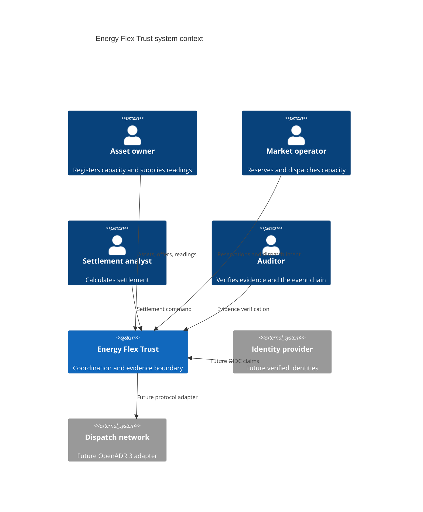
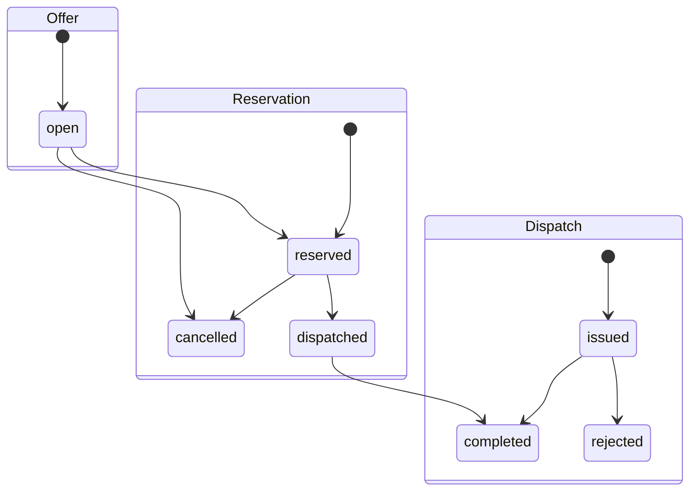

# Architecture

## Design goal

The system is a reference data-trust layer between flexibility-market actors and
external control infrastructure. It records who requested what, validates the
allowed transition, prevents accidental replay, and produces evidence that can be
independently recalculated.

It does not optimize portfolios, forecast demand, or directly control an asset.

## Context



## Components

| Component | Responsibility |
|---|---|
| FastAPI contracts | Type, range, timestamp, role-header and response validation |
| Coordination service | Transaction boundaries and workflow invariants |
| SQLAlchemy models | PostgreSQL-compatible persistence and uniqueness controls |
| Idempotency records | Bind an operation/key pair to one request hash and resource |
| Audit chain | Hash-link every material state transition |
| Evidence manifest | Bind settlement inputs to an audit event and deterministic hash |
| Dispatch publisher port | Prevent external protocol concerns entering domain logic |
| No-op publisher | Make the default runtime physically safe |

## Transaction model

Each command runs in one database transaction. The business row, its state change,
the audit event, and any idempotency record commit or roll back together.

Reservation and dispatch load the target aggregate with `SELECT ... FOR UPDATE` on
databases that support row locking. Unique constraints provide a second line of
defence against duplicate reservations, dispatches, readings, and settlements.

## State model



Unsupported transitions fail closed with `409 Conflict`.

## Audit-chain construction

Every event stores its predecessor hash. The event hash covers stable metadata,
canonicalized payload, UTC timestamp, and the predecessor hash:

```text
event_hash = SHA-256(canonical_json(event_fields + previous_hash))
```

Verification starts at a fixed genesis value and recomputes the entire ordered
chain. This detects mutation, reordering, non-tail deletion, and broken links in the
database available to the verifier. Tail truncation requires comparison with a
previously signed or externally anchored head.

## Evidence construction

Settlement selects readings fully contained in the dispatch window. The manifest
binds asset, offer, reservation, dispatch, reading IDs, delivered energy, price,
amount, and the settlement audit head. Its SHA-256 hash is stored beside it.

The v0.1 algorithm intentionally avoids partial-interval allocation. That requires
market-specific rules and belongs in a versioned settlement policy.

## Production gaps

- replace development role headers with verified OIDC identities and authorization;
- introduce Alembic migrations instead of startup schema creation;
- use a transactional outbox before publishing to a real dispatch network;
- sign periodic audit checkpoints and anchor them outside the primary database;
- encrypt sensitive fields and use managed secrets;
- add rate limiting, telemetry, backup/restore testing, and operational runbooks;
- validate a future OpenADR adapter against official schemas and certification tests.
