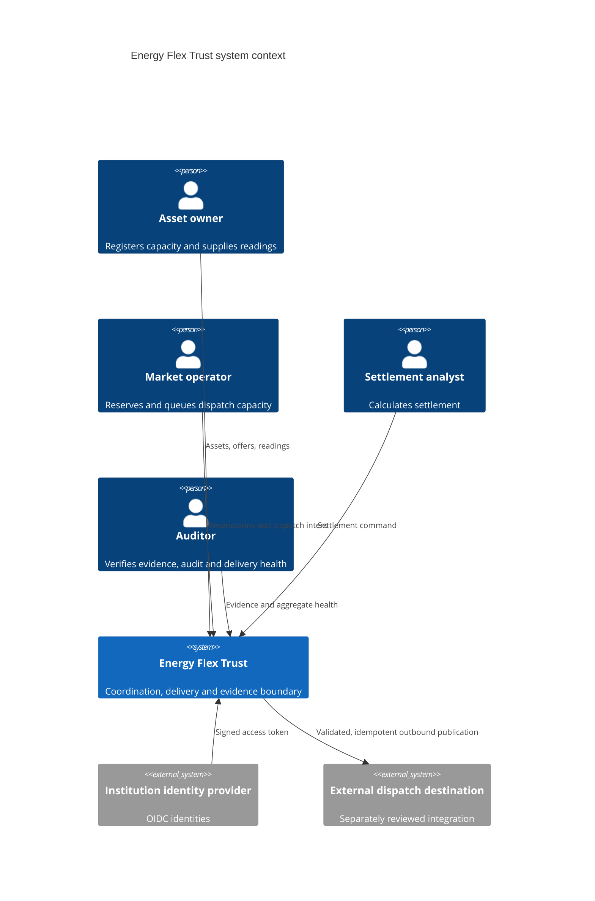
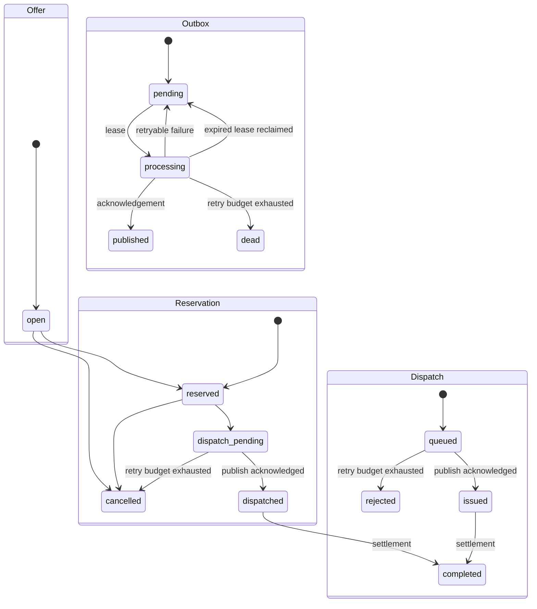

# Architecture

## Design goal

Energy Flex Trust is a reference data-trust layer between flexibility-market actors
and external control infrastructure. It records who requested what, validates the
allowed transition, prevents command replay, separates durable decisions from
external side effects, and produces evidence that can be independently
recalculated.

It does not optimize portfolios, forecast demand, or directly control an asset.

## Context



The bundled runtime does not connect to the external dispatch destination. The
no-op publisher is the safe default.

## Components

| Component | Responsibility |
|---|---|
| FastAPI contracts | Type, range, timestamp, authentication/role and response validation |
| Offline OIDC boundary | Verify issuer, audience, signature, time and one supported role against pinned trust material |
| Coordination service | Transaction boundaries and workflow invariants |
| SQLAlchemy models | PostgreSQL-compatible persistence and uniqueness controls |
| Alembic migrations | Version managed schema and fail closed on an incompatible deployed revision |
| Idempotency records | Bind an operation/key pair to one request hash and resource |
| Transactional outbox | Commit outbound dispatch work atomically with domain/audit state |
| Outbox worker | Lease due work, publish outside the transaction, retry within bounds and finalize state |
| Dispatch publisher port | Carry a durable downstream idempotency key across the external boundary |
| OpenADR contract boundary | Separate mapping, schema validation and transport without bundling a live connector |
| No-op publisher | Make the default worker physically safe |
| Audit chain | Hash-link every material state transition |
| Signed checkpoint | Bind a verified audit head to independently retainable signature evidence |
| Evidence manifest | Bind settlement inputs to an audit event and deterministic hash |
| Operations endpoint | Expose low-cardinality outbox health without queue payload disclosure |

## Transaction model

A business command runs in one database transaction. The business row, state
change, audit event, idempotency record and any required outbox row commit or roll
back together.

Outbound publication is deliberately **not** performed in that transaction. The
worker first commits a lease, calls the publisher outside a database transaction,
then commits either success or failure state. This removes the database/network
dual-write problem from the API request path.

The delivery model is at least once. A crash after successful external publication
but before local finalization can cause replay after lease expiry. The publisher
therefore receives the durable original idempotency key and a production
destination must provide equivalent deduplication.

Reservation and dispatch command paths load the target aggregate with
`SELECT ... FOR UPDATE` on databases that support row locking. The worker uses a
row claim with `SKIP LOCKED` where supported. Unique constraints provide another
line of defence against duplicate reservations, dispatches, readings, settlements
and outbox topic/idempotency pairs.

## State model



Unsupported domain transitions fail closed. Settlement requires reservation
`dispatched` and dispatch `issued`; a queued or rejected dispatch cannot settle.

## Audit-chain construction

Every event stores its predecessor hash. The event hash covers stable metadata,
canonicalized payload, UTC timestamp, and the predecessor hash:

```text
event_hash = SHA-256(canonical_json(event_fields + previous_hash))
```

Verification starts at a fixed genesis value and recomputes the ordered chain. The
worker adds `dispatch.published` after acknowledged delivery and
`dispatch.delivery_failed` when the retry budget is exhausted.

A valid head can be signed as an audit checkpoint. The checkpoint only helps detect
later tail truncation when it or its digest is retained outside the same
administrative compromise domain.

## Evidence construction

Settlement selects readings fully contained in the acknowledged dispatch window.
The manifest binds asset, offer, reservation, dispatch, reading IDs, delivered
energy, price, amount, and the settlement audit head. Its SHA-256 hash is stored
beside it.

The reference algorithm intentionally avoids partial-interval allocation. That
requires market-specific policy and belongs in a separately versioned settlement
rule set.

## OpenADR boundary

The domain depends only on `DispatchPublisher`. `OpenAdr3ContractPublisher` composes
three ports: mapping, schema validation and transport. Validation must succeed
before transport. The repository does not ship a credentialed transport or copy an
approximation of normative OpenADR schemas; real integration material is a separate
reviewed dependency and does not change domain transaction guarantees.

## Remaining production gaps for v0.9/v1.0

- production PostgreSQL migration/rollback/backup/restore drills;
- tenant isolation and row-level authorization design;
- production service/workload identities and least-privilege database roles;
- KMS/HSM-backed signing implementation and key rotation runbook;
- credentialed destination authentication, strict egress policy and timeouts;
- approved dead-message reconciliation/re-drive and emergency-stop procedures;
- rate limiting, SLOs, alert thresholds and capacity/load/failover testing;
- SBOM, provenance, dependency and container hardening gates;
- institution-specific regulatory, market and interoperability assurance.
