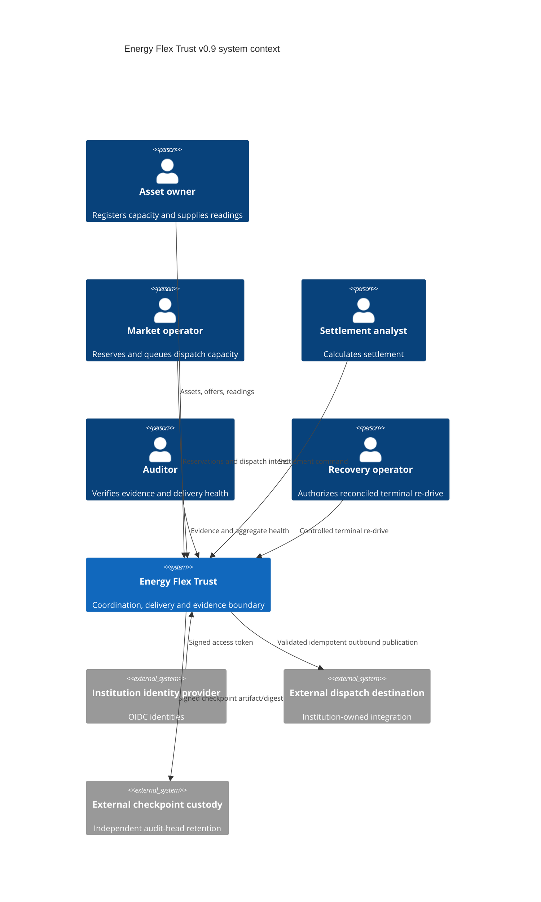
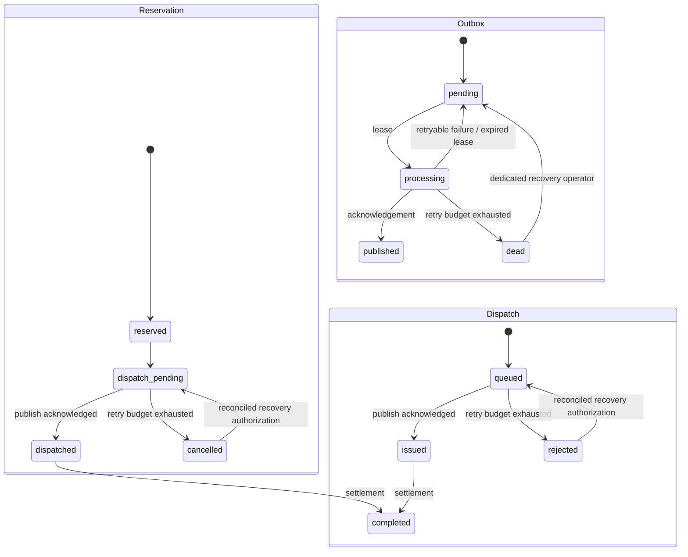

# Architecture

## Design goal

Energy Flex Trust is a reference trust layer between flexibility-market actors and
external control infrastructure. It records who requested what, validates allowed
state transitions, prevents command replay, separates durable decisions from
external side effects and produces independently recalculable evidence.

It does not optimize portfolios, forecast demand or directly control an asset.

## Context

The repository does not ship the credentialed external dispatch integration. The
built-in no-op publisher is available only in development/test; a production-like
worker fails closed without an explicitly injected institution-owned publisher.

## Components

| Component | Responsibility |
|---|---|
| FastAPI contracts | Type, range, timestamp, authentication/role and response validation |
| Offline OIDC boundary | Verify issuer, audience, signature, time and exactly one supported role against pinned trust material |
| Coordination service | Transaction boundaries and workflow invariants |
| SQLAlchemy models | PostgreSQL-compatible persistence and uniqueness controls |
| Alembic migrations | Version managed schema and fail closed on incompatible deployed revision |
| Idempotency records | Bind an operation/key pair to one request hash and resource |
| Transactional outbox | Commit outbound dispatch work atomically with domain/audit state |
| Outbox worker | Lease due work, publish outside DB transaction, retry within bounds and finalize state |
| Dispatch publisher port | Carry durable downstream idempotency across the external boundary |
| OpenADR contract boundary | Separate mapping, authoritative-schema validation and transport |
| Recovery authorization | Re-arm one reconciled terminal dispatch while preserving original idempotency identity |
| Audit chain | Hash-link every material state transition |
| Signed checkpoint | Bind a verified audit head to independently retainable signature evidence |
| Evidence manifest | Bind settlement inputs to an audit event and deterministic hash |
| Operations endpoint | Expose low-cardinality outbox health without queue-payload disclosure |
| PostgreSQL role matrix | Separate migrator, API, worker, recovery and auditor DB privileges |
| Release evidence workflows | Exercise recovery, security analysis, SBOM, artifact digests and hardened container properties |

## Transaction and delivery model

A business command runs in one database transaction. Business rows, state changes,
audit evidence, idempotency records and any required outbox message commit or roll
back together.

Outbound publication is deliberately not performed in that transaction. The worker
commits a claim/lease, invokes the publisher outside the database transaction, then
commits success or failure state. This removes the database/network dual-write from
the API request path but cannot create exactly-once external effects.

A crash after successful external publication but before local finalization may
cause replay after lease expiry. The publisher therefore receives the original
durable idempotency key and a production destination must implement authoritative
deduplication.

Reservation/dispatch commands use row locking where supported. The worker uses
`SKIP LOCKED` for concurrent PostgreSQL claims. SQLite remains a development/test
path and is not a production multi-worker concurrency claim.

## State model

Re-drive does not publish anything. It preserves the existing outbox row and
original idempotency key, resets the delivery cycle and appends
`dispatch.redrive_authorized` audit evidence. The normal worker/publisher path must
still complete the external attempt.

## Persistence and least privilege

Managed runtimes require the exact Alembic head. v0.9 reference grants separate:

- `flextrust_migrator` — schema DDL/change window;
- `flextrust_api` — normal coordination DML and outbox enqueue;
- `flextrust_worker` — outbox claim/finalization and dispatch state transitions;
- `flextrust_recovery` — terminal re-drive state only;
- `flextrust_auditor` — read-only verification.

Runtime identities receive no general DELETE or DDL capability. CI validates both
required and prohibited privileges on PostgreSQL 16 and 17.

## Audit and evidence

Every event stores its predecessor hash. Verification recomputes the ordered chain
from a fixed genesis value. The worker adds `dispatch.published` and terminal
`dispatch.delivery_failed`; controlled recovery adds
`dispatch.redrive_authorized`.

A valid head can be signed as an audit checkpoint. A signature does not make the
database immutable. Tail-truncation detection depends on retaining the checkpoint
artifact or digest outside the same compromise domain.

Settlement evidence binds the relevant asset, offer, reservation, dispatch,
readings, financial values and audit head into a deterministic content hash.

## Upgrade compatibility

New v0.9 dispatch outbox messages carry `energy-flex-dispatch.v1`. The worker also
accepts the exact legacy v0.3 unversioned shape so already-committed work can drain
across an upgrade. Unknown versions or shapes fail closed.

The public `/v1` route set is release-snapshotted and tested. Exact-schema startup
means the project does not claim arbitrary mixed-version rolling deployments; see
[Compatibility](COMPATIBILITY.md).

## Release-evidence architecture

v0.9 adds independent CI lanes for:

1. Python 3.11/3.12/3.13 unit/contract behavior;
2. PostgreSQL 16/17 migration, dump/restore and privilege matrices;
3. CodeQL and runtime dependency vulnerability analysis;
4. wheel/container build, SPDX SBOM, SHA-256 and artifact/SBOM attestation.

These lanes provide engineering evidence; they do not make institution-specific
security, safety or regulatory decisions.

## Remaining production/institution gaps

Tracked in [Residual risk](RESIDUAL_RISK.md), notably:

- credentialed destination authentication, egress control and live transport;
- tenant-level row isolation where shared multi-tenant persistence requires it;
- institution-owned KMS/HSM checkpoint signing and independent retention;
- PAM/authenticated human recovery-operator wrapper;
- production backup encryption, immutable retention and approved RPO/RTO;
- gateway rate limiting/WAF/SLO/load/failover controls;
- field-level protection where classification requires it;
- immutable GitHub Action/base-image pinning policy;
- market, regulatory, interoperability and physical-safety assurance.
